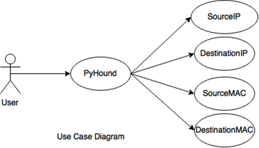
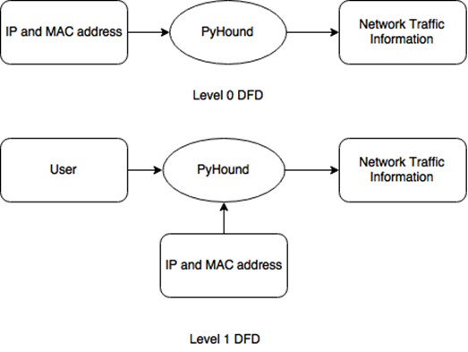
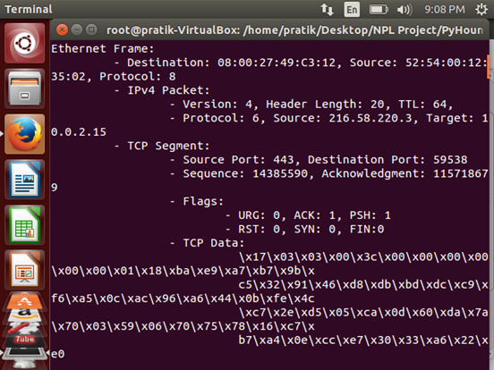
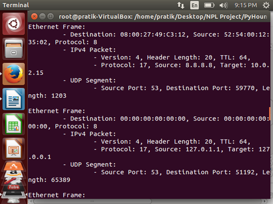
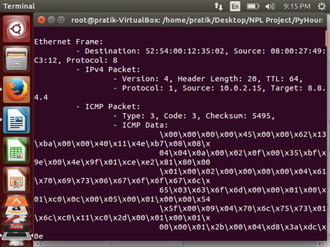

##PyHound - A Packet Sniffer in Python

_By:_
_Pratik Kshirsagar, _ _Chinmay Terse_ _and_ _Rahul Agarwal_

## To Do

- Interpret HTTP data (tcp.dest_port will be 80)

###Packet Sniffer
Computer software that can __intercept and log traffic__ flowing through a network or part of a network is called 
Packet Sniffer.
 
It works by setting the __NIC (Network Interface Card) in Promiscuous Mode.__
Promiscuos Mode is that mode in which the controller sends all traffic that ir receives to the CPU, instead of only those packets it is intended to receive.
  
_Other Modes: Monitor Mode_

###How Data Is Exchanged on the Internet

1.	An __HTTP(Hyper Text Transfer Protocol) request__ is sent to the target server for the requested resource.
2.	This HTTP request is wrapped inside an __IP packet__ (Internetworking Protocol).
3.	All of this is packed in an __Ethernet frame.__

So, in the implementation of the packet sniffer, we first have to unpack the Ethernet frame.

__Protocol Numbers__ 
1 		&nbsp;&nbsp;ICMP (Internet Control Messaging Protocol) 
4		&nbsp;&nbsp;IP-in-IP encapsulation (IP version 4) 
41		&nbsp;&nbsp;IPv6 encapsulation (IP version 6) 
6		&nbsp;&nbsp;TCP (Transmission Control Protocol) 
17		&nbsp;&nbsp;UDP (User Datagram Protocol) 
8 		&nbsp;&nbsp;EGP (<a href="https://en.wikipedia.org/wiki/Exterior_Gateway_Protocol">Exterior gateway Protocol</a>) 
9		&nbsp;&nbsp;IGP (<a href="https://en.wikipedia.org/wiki/Interior_gateway_protocol">Interior Gateway Protocol</a>) 

###Sockets

A socket is one end-point of a two-way communication link between programs on the network. Sockets are bound to a port number so that the TCP layer can identify the application the data is destined to. 

###IP Header Packet Format

###TCP/IP packet

###Use Case and DFD for PyHound

  

##Output Screens

__TCP Segment in IPv4 Packet(Protocol = 6)__ 
  
__UDP Segment in IPv4 Packet(Protocol = 17)__ 
  
__ICMP Packet in IPv4 Packet(Protocol = 1)__ 
 

###Advantages and Limitations
_Advantages_

1.	Easy to understand. 
	The system is easily understandable because simple socket programming concepts have been used.

2.	No extensive requirements. 
	This system has no extensive requirements and can run on any unix/linux system which has a basic Python compiler and terminal.

_Limitations_

1.	Does not store the packet information and data. 
		The biggest problem with the developed system is that, the program doesn’t store the data, it just displays it and once the terminal is closed the information is gone.

2.	Cannot run on windows. 
		Another drawback is that, this program uses a socket function which is not available in windows version of python, but exclusive to linux/unix systems.

3.	Only core functionality available. 
		Other supplementary and complimentary functionalities are missing.

