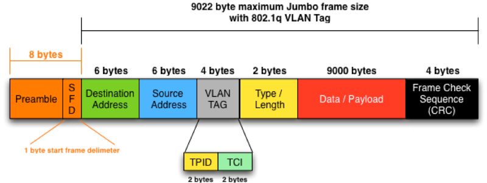

## To Do

- Interpret HTTP data (tcp.dest_port will be 80)

###How Data Is Exchanged on the Internet

1.	An __HTTP(Hyper Text Transfer Protocol) request__ is sent to the target server for the requested resource.
2.	This HTTP request is wrapped inside an __IP packet__ (Internetworking Protocol).
3.	All of this is packed in an __Ethernet frame.__

So, in the implementation of the packet sniffer, we first have to unpack the Ethernet frame.

##Ethernet Frame

